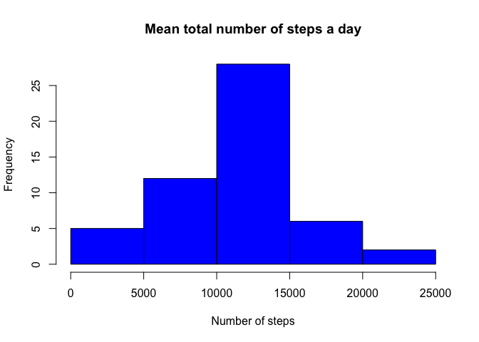

# Reproducible Research: Peer Assessment 1


## Loading and preprocessing the data
First we load the dataset activities.

```r
activity <- read.csv("activity.csv", header = T, sep = ",")
str(activity)
```

```
## 'data.frame':	17568 obs. of  3 variables:
##  $ steps   : int  NA NA NA NA NA NA NA NA NA NA ...
##  $ date    : Factor w/ 61 levels "2012-10-01","2012-10-02",..: 1 1 1 1 1 1 1 1 1 1 ...
##  $ interval: int  0 5 10 15 20 25 30 35 40 45 ...
```

## What is mean total number of steps taken per day?
First we prepare the dataset for answering this question.

```r
steps <- aggregate(steps ~ date, data = activity, sum, na.rm = TRUE)
```

Calculate the mean of the total number of steps taken per day.

```r
mean(steps$steps, na.rm = TRUE)
```

```
## [1] 10766.19
```

Calculate the median of the total number of steps taken per day.

```r
median(steps$steps, na.rm = TRUE)
```

```
## [1] 10765
```

Report the total number of steps taken per day.

```r
hist(steps$steps,main = "Mean total number of steps a day", xlab = "Number of steps", col = "blue")
```

<!-- -->


## What is the average daily activity pattern?
First we prepare the dataset for answering this question.


```r
steps.interval <- tapply(activity$steps, activity$interval, mean, na.rm = T)
```

A time series plot (type = "1") of the 5-minute interval (x-axis) and the average number of steps taken, averaged across all days (y-axis).

```r
plot(steps.interval, type = "l", main = ("Average steps vs days interval"), 
    ylab = "Number of steps", col = "blue")
```

<!-- -->

Which 5-minute interval, on average across all the days in the dataset, contains the maximum number of steps?

```r
seq(along = steps.interval)[steps.interval == max(steps.interval)]
```

```
## [1] 104
```


## Imputing missing values
Calculate and report the total number of missing values in the dataset (i.e. the total number of rows with ????????s)

```r
colSums(is.na(activity))
```

```
##    steps     date interval 
##     2304        0        0
```

Devise a strategy for filling in all of the missing values in the dataset. The strategy does not need to be sophisticated. For example, you could use the mean/median for that day, or the mean for that 5-minute interval, etc.

```r
mean(activity$steps, na.rm = T)
```

```
## [1] 37.3826
```

Create a new dataset that is equal to the original dataset but with the missing data filled in.

```r
activity.nona <- activity
activity.nona$date <- as.Date(activity.nona$date)
activity.nona$steps[is.na(activity.nona$steps)] <- mean(activity.nona$steps, na.rm = T)
colSums(is.na(activity.nona))
```

```
##    steps     date interval 
##        0        0        0
```

Make a histogram of the total number of steps taken each day and Calculate and report the mean and median total number of steps taken per day. Do these values differ from the estimates from the first part of the assignment? What is the impact of imputing missing data on the estimates of the total daily number of steps?

```r
library(ggplot2)
```

```
## Warning: package 'ggplot2' was built under R version 3.2.4
```

```r
activity.date <- aggregate(steps ~ date, data = activity, FUN = sum)
activity.date$date <- as.Date(activity.date$date, "%Y-%m-%d")
head(activity.date)
```

```
##         date steps
## 1 2012-10-02   126
## 2 2012-10-03 11352
## 3 2012-10-04 12116
## 4 2012-10-05 13294
## 5 2012-10-06 15420
## 6 2012-10-07 11015
```

```r
ggplot( data = activity.date, aes( date, steps), title = "Total number of steps each day (no missing data)") +
geom_line(colour="blue") + scale_x_date(date_labels = "%b %d %y")
```

<!-- -->


## Are there differences in activity patterns between weekdays and weekends?
Create a new factor variable in the dataset with two levels ??? ???weekday??? and ???weekend??? indicating whether a given date is a weekday or weekend day.

```r
activity.nona$weekdays <- factor(format(activity.nona$date,"%A"))
levels(activity.nona$weekdays)
```

```
## [1] "Friday"    "Monday"    "Saturday"  "Sunday"    "Thursday"  "Tuesday"  
## [7] "Wednesday"
```

```r
levels(activity.nona$weekdays) <- list(weekday = c("Monday", "Tuesday","Wednesday", "Thursday", "Friday"),
                                                weekend = c("Saturday", "Sunday"))
table(activity.nona$weekdays)
```

```
## 
## weekday weekend 
##   12960    4608
```

Make a panel plot containing a time series plot (i.e. ???????????????? = "????") of the 5-minute interval (x-axis) and the average number of steps taken, averaged across all weekday days or weekend days (y-axis). 

```r
library(lattice)
activty.avg <- aggregate(activity.nona$steps, 
                      list(interval = as.numeric(as.character(activity.nona$interval)), 
                           weekdays = activity.nona$weekdays),FUN = "mean")
names(activty.avg)[3] <- "meanOfSteps"

xyplot(activty.avg$meanOfSteps ~ activty.avg$interval | activty.avg$weekdays, 
       layout = c(1, 2), type = "l", xlab = "Interval", ylab = "Number of steps")
```

<!-- -->
